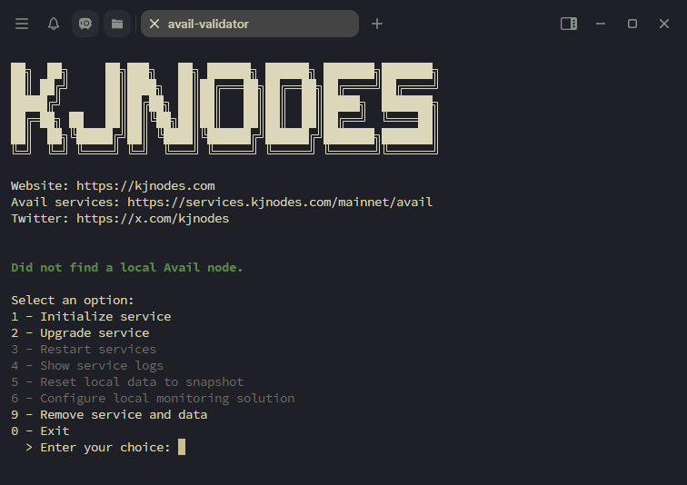

# Avail Node Configuration Script

This project provides a Bash script to initialize and manage a Avail testnet node. The script provides multiple features such as initializing and upgrading the services, observing logs, and catching up quickly using a snapshot.

## Quick Start

To initialize or manage your Avail node, simply run the following line in your terminal:

```sh
bash <(curl -sL https://github.com/kjnodes/avail-node-configuration/raw/refs/heads/main/script.sh)
```



## Features

Functionality overview:

- Initialize Service: Installs the Avail node with all dependencies.
- Upgrade Service: Updates the Avail node binaries.
- Restart Services: Restarts the Avail service.
- Show Service Logs: Streams real-time logs for the Avail service.
- Reset Local Data to Snapshot: Downloads the latest snapshot to reset the node, replacing local data.
- Configure Local Monitoring Solution: Sets up Prometheus and Grafana monitoring with a pre-installed dashboard and Telegram Alerting.
- Remove Service and Data: Deletes all installed services, binaries, configurations, and chain data for a clean reinstall.

## Monitoring Setup

The script can configure a monitoring solution, based on [`kjnodes/avail-node-monitoring`](https://github.com/kjnodes/avail-node-monitoring).

For configuration, you will need:
- A Telegram bot token, which can be obtained from [@botfather](https://t.me/botfather), based on instructions outlined in [Telegram Bots documentation](https://core.telegram.org/bots#6-botfather).
- Your Telegram user ID, which can be obtained from [@userinfobot](https://t.me/userinfobot).

After setup, Grafana will be available at your node's IP on port 9999 with default credentials `admin/admin`.
